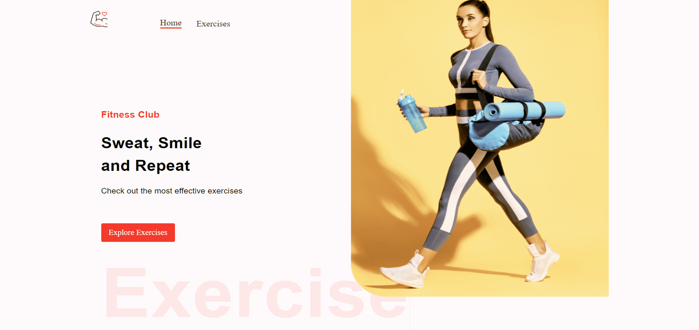

Golds Gym Fitness App: Elevate Your Workout
===========================================  

[Live Website](https://utkarsh-golds-gym.netlify.app/)

The Golds Gym Fitness App, built on ReactJS and styled with Material UI, is your ultimate fitness companion. It seamlessly integrates ExerciseDB data from RapidAPI, offering a wealth of exercise options.

## Key Features:  

* *Exercise Selection*: Choose from various exercise categories and target specific muscle groups, tailoring your workout to your needs.  

* *Extensive Database*: Access over a thousand exercises with practical examples, enabling a diverse and effective fitness regimen.  

* *Pagination*: Navigate through exercises effortlessly with user-friendly pagination.  

* *Exercise Details*: Dive deep into exercise details, understanding proper form and technique for maximum benefits.  

* *YouTube Integration*: Pull related exercise videos from YouTube, ensuring you have visual guidance for your workouts.  

* *Similar Exercises*: Discover similar exercises to add variety and challenge to your routines.  

The Golds Gym Fitness App is more than just an exercise directory; it's a comprehensive tool for optimizing your fitness journey. Whether you're a seasoned athlete or a beginner, this app provides the resources and information you need to elevate your workouts and reach your fitness goals.  

